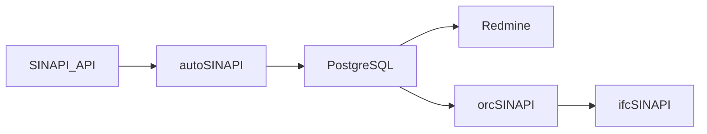
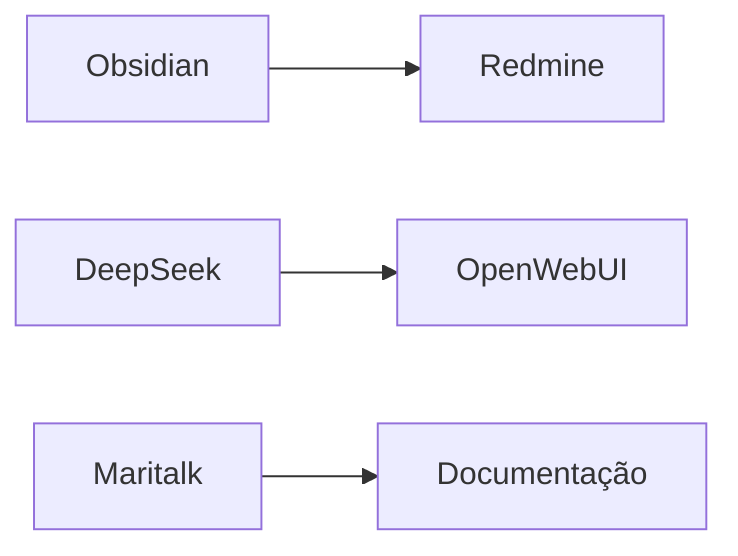

# **Foton**  
## Controle Integrado de Informações para Construção Civil  

     

---

## **🚀 Revolucione Sua Gestão de Obras**  

O **Foton** é um ecossistema integrado que transforma como arquitetos e engenheiros gerenciam informações em projetos de construção. Combinamos:  

- **Gestão de projetos** (Redmine)  
- **Automação inteligente** (n8n + WAHA)  
- **Assistência especializada** (OpenWebUI)  
- **Dados SINAPI em tempo real** (autoSINAPI)  

**Objetivo principal:**  
> Capacitar profissionais a operarem todos os departamentos de um escritório (orçamentos, BIM, compras) usando ferramentas open-source integradas.  

**Para quem é:**  
🏗️ Construtoras • 📐 Escritórios de Arquitetura • 🧮 Orçamentistas • 👷‍♂️ Gestores de Obra  

---

## **⚙️ Arquitetura Técnica**  

### **Núcleo do Sistema (Docker Compose)**  
```yaml
services:
  postgres:          # Banco de dados unificado
  redmine:           # Gestão de projetos (http://localhost:3000)
  n8n:               # Automações com WAHA (WhatsApp)
  searxng:           # Busca unificada
  openwebui:         # Assistentes BIM/SINAPI
  obsidian:          # Documentação colaborativa
```

### **Módulos Chave**  
| Módulo | Função | Status |  
|--------|--------|--------|  
| [autoSINAPI](https://github.com/LAMP-LUCAS/AutoSINAPI) | Mineração de dados SINAPI | ✅ Produtivo |  
| sincSINAPI | Sincronização SINAPI ↔ PostgreSQL | 🚧 Em desenvolvimento |  
| orcSINAPI | Geração de orçamentos | 🚧 Em desenvolvimento |  
| ifcSINAPI | Integração BIM-SINAPI | 🚧 Em desenvolvimento |  

### **Estrutura de Dados**  


---

## **🛠️ Comece Agora!**  

### Via Docker (Desenvolvedores):  
```bash
git clone https://github.com/seu-usuario/foton.git
cd foton

# Configure suas variáveis
cp .env.example .env

# Inicie o sistema
docker-compose up -d
```

**Acesse as ferramentas:**  
- Redmine: http://localhost:3000  
- n8n: http://localhost:5678  
- OpenWebUI: http://localhost:8080  

---

## **🌱 Participe da Comunidade**  

### Próximos Passos do Projeto:  
- [ ] Lançamento da plataforma comunitária (Q3 2025)  
- [ ] Trilhas de certificação BIM/SINAPI  
- [ ] Biblioteca pública de famílias RVT  

### Como Contribuir:  
1. Reporte bugs ou sugira features nas [Issues](https://github.com/seu-usuario/foton/issues)  
2. Participe das discussões no [Fórum](https://comunidade.mundoaec.com)  
3. Desenvolva plugins: [Guia do Contribuidor](CONTRIBUTING.md)  
4. Ajude-nos a comprar ☕! [Doar](https://mundoaec.com/doacoes)  

---

## **💡 Modelo Colaborativo**  


Ajude-nos a manter o projeto! Escolha sua forma de participação:  

| Plano | Benefícios | Investimento |  
|-------|------------|--------------|  
| **💻 Econômico** | • Acesso à comunidade<br>• 50 créditos/mês (OpenWebUI)<br>• Wiki e fóruns | R$10 (individual)<br>R$25 (equipe) |  
| **🚀 Tipo** | • Redmine SaaS (1GB)<br>• Cursos básicos<br>• 200 créditos IA | R$50 (individual)<br>R$150 (equipe) |  
| **🏆 Penthouse** | • Redmine Premium (10GB)<br>• Todos cursos<br>• Suporte 24h<br>• n8n auto-hospedado | R$200 (individual)<br>R$1000 (equipe) |  

### Detalhes dos Planos: [Lista de espera](https://mundoaec.com/whitelist) 
- **Econômico:**  
  - OpenWebUI em modo consulta  
  - Sem persistência de dados
  - Acesso à plataforma :  
[](https://mundoaec.com/assinatura)

- **Tipo:**  
  - Backup diário automático  
  - Acesso às bibliotecas SINAPI
  - Acesso à plataforma :  
[](https://mundoaec.com/assinatura)

- **Penthouse:**  
  - Consultoria BIM mensal  
  - Configuração dedicada
  - Acesso à plataforma :  
[](https://mundoaec.com/assinatura)


---

## **📜 Licenciamento**  

- **Núcleo do sistema:** [GPLv3](LICENSE)  
- **Conteúdo educacional:** Copyright © Foton  
- **Dados SINAPI:** Licença aberta (IBGE)  

```
Este programa é software livre: você pode redistribuí-lo e/ou modificar
sob os termos da GNU General Public License conforme publicada pela
Free Software Foundation, versão 3 da Licença.
```

---

## **📞 Contato**  

✉️ **Suporte Técnico:** lucas@arqlamp.com  
🌐 **Site Oficial:** [https://mundoaec.com](https://mundoaec.com)  
💬 **Comunidade:** [Forum Foton](https://comunidade.mundoaec.com)  

---

**Feito com** 💙 **e** ☕ **usando:**  


**Créditos:** IBGE • Redmine • Comunidade Open-Source
